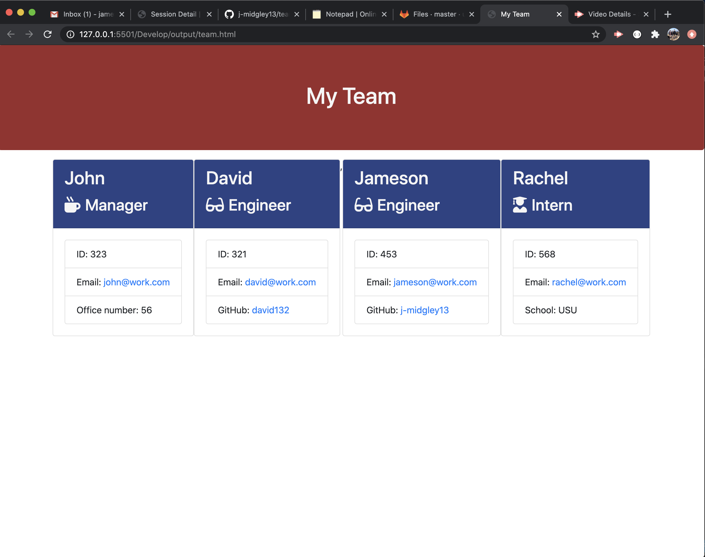
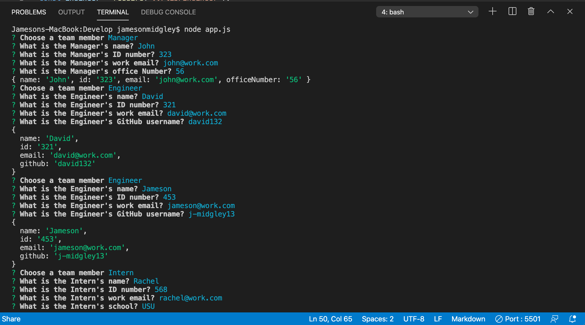

# Team Generator Homework 10  

## Introduction. 

This assignment was given for an employee (a manager, most likely) to construct a team given a series of node prompts. The selected team would then be populated into an html page to an easy-to-read breakdown of the team with name, employee number, email, and other unique identifiers for the team. We were given a series of tests so we could write proper code to gather the given information for Manager, Engineer, and Intern employees.

## Table of Contents:
* [Objectives](#Objectives)
* [Process](#Process)
* [Challenges](#Challenges)
* [Summary](#Summary)
* [Video](#Video)
* [Screenshots](#Screenshots)

## Objectives. 

```md
As a manager,
I want to generate a webpage that displays my team's basic information
so that I have quick access to emails and GitHub profiles.
```

## Process 

* I first copied the homework into my own repository for the assignment.  
* I then installed inquirer and npm test into my repo.  
* I then went to the employee.js file to beign writing code to pass tests.
* I then went to the other js files (manager, engineer, intern) to inherit from emloyee and also pass tests. 
* I then continued to the app.js file to write the code that asked questions to build out a team through npm inquirer.
* I added functions to inquirer make sure no one can have the same employee number, verified proper email structure, and got GitHub information for Engineers and school information for interns.
* I then added the writefilesync to render the team, and it created and populated a team.html file located in an output folder.   

## Challenges

This assignment took our first node project and turned the dial up. The main challenge I faced was writing the code that got the tests to pass. At first, the code to get the tests to pass was difficult to do. My first instinct is to write code out, try it, and if it didn't work then I would go change it until it does. This forced me to do the opposite. Write code to fail first so it's easier to make work more broadly. As I got used to the process, I found it easier to write code this way. Adding more intricate functions for the inquirer validations was more difficult than I had imagined. I was stuck for a while on that when I got some good inspiration and help from classmates. After figuring out the proper way to output the team.html, it was just up to styling from that point. Challenging but enjoyable assignment!

## Summary

This assignment was fun but challenging for me! Front end vs. back end web development is much more different than I had anticipated. Back end requires more mathematical brain, following very logical steps. It isn't very visual as front end is. It is fun to learn how to connect different pages and the process it takes so it can all come together.

## Video 

  
[Link to my Google Drive with the full video](https://drive.google.com/file/d/1mfURMUb5kjlGnR7lsMDXyL8M4zZfpsGx/view)

## Screenshots




